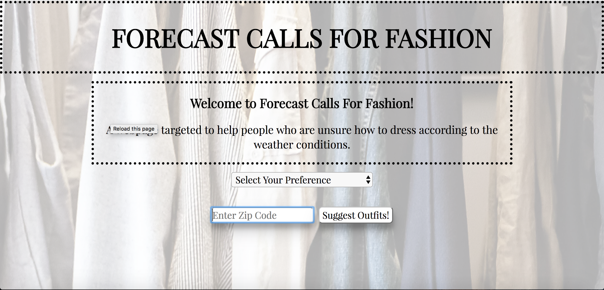

# Forecast Calls For Fashion
### To use this code and open webpage follow these steps:
1. Fork and clone this repo!
2. Open in atom or your text editor of choice.
3. `npm install` in repo through the terminal.
4. To run tests open the `index.html`, located in the `test` folder, in the browser.
5. open `index.html` in browser or use this link [Forecast Calls For Fashion](http://forecast-fashion.surge.sh/)
### Steps to use Forecast Calls For Fashion:
1. Select your preference of clothing (women's clothing or men's clothing).
2. Insert your chosen zip code into the search bar.
3. Hit the "Suggest Outfits!" button to see suggestions and weather conditions.
4. Get to your closet so you can dress appropriately for the weather!

